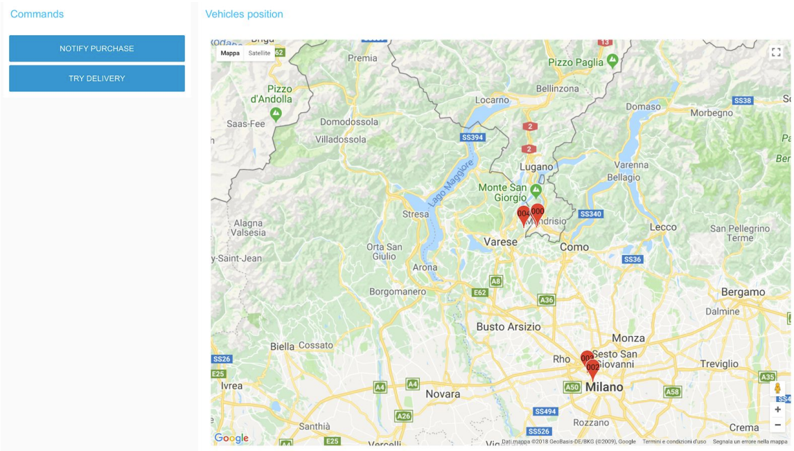
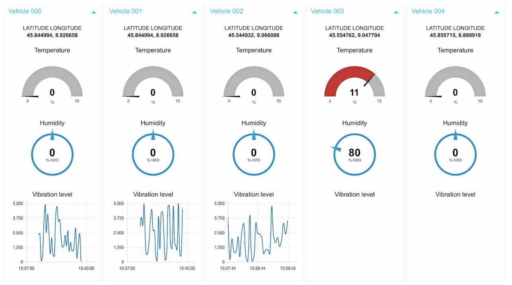
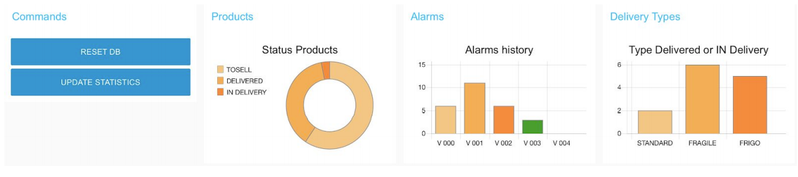
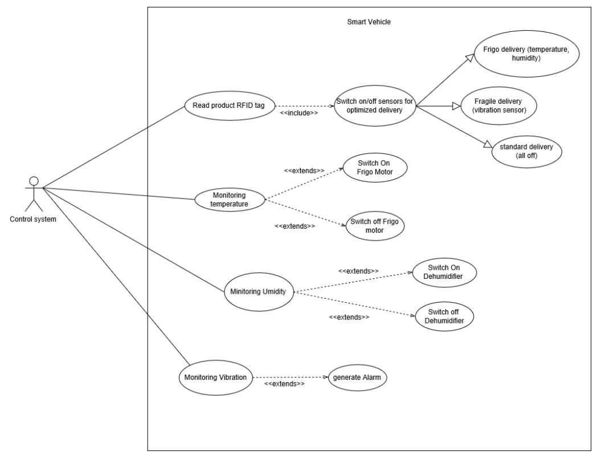

# ABOUT

The aim of the project was to create a prototype of a Central Monitoring System for smart shipping.

Here the real-time dashboards that have been created:

"Position monitoring dashboard"

"Vehicles monitoring dashboard"

"Database monitoring dashboard"

Here a use case diagram of the prototype:

# SETUP INSTRUCTIONS

Downlaod the VirtualBox VM from the release section on GitHub,
or install on your machine mongoDB, mosquitto, node-red, Java and follow these setup instructions.

1. Start a mongodb instance and create three collections (products, travels_test, vehicles) and then insert data through JSON file 
    or dumps in mongodb folder.

2. Start MQTT broker on default port 1883. (mosquitto, for example)

3. Start the Java simualtor. (JDK 8)

4. Launch node-red and import these palettes: node-red-contrib-crypto-js, node-red-contrib-mongodb3, node-red-dashboard

5. Import all node-red flows.

6. Connect to the node-red dashboard at: http://localhost:1880/ui/

This project is licensed under the terms of the Apache 2.0 License.
